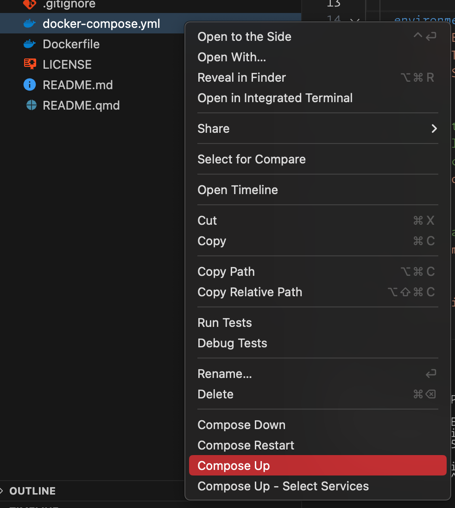

# Navigating Hostility: The Effect of Nonprofit Transparency and Accountability on Donor Preferences in the Face of Shrinking Civic Space


- [Abstract](#abstract)
- [Replication](#replication)
  - [Method 1: Docker Compose](#method-1-docker-compose)
  - [Method 2: Run locally with {renv} and project-specific packages](#method-2-run-locally-with-renv-and-project-specific-packages)
  - [Method 3: Run locally with packages installed systemwide](#method-3-run-locally-with-packages-installed-systemwide)
- [🤐🌥️🚶: Note on “silent skywalk” project name](#zipper_mouth_facesun_behind_large_cloudwalking-note-on-silent-skywalk-project-name)
- [Licenses](#licenses)
- [Contributions and Code of Conduct](#contributions-and-code-of-conduct)

<!-- README.md is generated from README.qmd. Please edit that file -->

------------------------------------------------------------------------

[Suparna Chaudhry](http://www.suparnachaudhry.com/) • Lewis & Clark College  
[Marc Dotson](https://occasionaldivergences.com/about) • Utah State University  
[Andrew Heiss](https://www.andrewheiss.com) • Georgia State University

------------------------------------------------------------------------

<!-- badges: start -->

[](https://doi.org/10.31235/osf.io/hu6a5) [](https://doi.org/10.17605/OSF.IO/R59XZ) [](https://doi.org/10.5281/zenodo.14721277)
<!-- badges: end -->

------------------------------------------------------------------------

> Suparna Chaudhry, Marc Dotson, and Andrew Heiss, “Navigating Hostility: The Effect of Nonprofit Transparency and Accountability on Donor Preferences in the Face of Shrinking Civic Space,” *Nonprofit and Voluntary Sector Quarterly* (forthcoming).

------------------------------------------------------------------------

## Abstract

Governments across the world have increasingly used laws to restrict the work of nonprofits, which has led to a reduction in public or official foreign aid directed towards these groups. Many international nonprofits, in response, have turned to individual donors to offset the loss of traditional funding. What are individual donors’ preferences regarding donating to legally besieged nonprofits abroad? We conducted a conjoint experiment on a nationally representative sample of likely donors in the US and found that learning about host government criticism and legal restrictions on nonprofits decreases individuals’ preferences to donate to them. However, organizational features such as financial transparency and accountability can protect against this dampening effect. Our results have important implications both for understanding private international philanthropy and how nonprofits can better frame their fundraising appeals at a time when they are facing restrictive civic spaces and hostile governments abroad.

## Replication

To maximize replicability, we wrote our manuscript using [Quarto](https://quarto.org/), which allowed us to mix computational figures, text, and tables with the actual prose of the manuscript. This means that there’s no need to rely on comments within code to identify the location of each appropriate result in the manuscript—all results are programmatically included when rendering the document.

We use the [{renv} package](https://rstudio.github.io/renv/articles/renv.html) to create a stable version-specific library of R packages, and we use the [{targets} package](https://docs.ropensci.org/targets/index.html) to manage all the file dependencies and run the analysis. {targets} is especially helpful with long-running objects like the main models, which take ≈40 minutes to run—as long as upstream dependencies don’t change, the models only need to run once, and can be loaded from {targets}’s data store thereafter.

Because it can often be difficult to set up and configure version-specific libraries of R packages and install specific versions of Stan, we provide three methods for replicating our analysis:

1.  **Running a Docker container built and orchestrated with Docker Compose.** This builds a complete computational environment, including non-R software like Quarto, pandoc, LaTeX, dvisvgm, fonts, and other auxiliary elements.
2.  **Restoring a project-specific library of all required R packages on your computer with {renv}.** This is the next recommended approach, since {renv} will install package versions as of April 2025 when we ran this code prior to publication. However, you’re responsible for installing all the non-R elements, like Quarto and LaTeX (detailed instructions are included below).
3.  **Installing the most current versions of all required R packages on your computer systemwide.** This is the least recommended approach, since the included script will grab the latest version of all R packages from CRAN and install them in your system library. As with method 2, you’re still responsible for installing all the non-R elements on your own.

The original pre-cleaned data for the analysis is accessible in `silent-skywalk/data/raw_data`.

The complete {targets} pipeline generates two output artifacts:

- **Manuscript**: HTML and PDF versions of the manuscript and appendix, located at `silent-skywalk/manuscript/output/` (or at [`http://localhost:8888/analysis/paper.html`](http://localhost:8888/analysis/paper.html) if you run the pipeline with Docker Compose).
- **Analysis notebook**: A static website containing more complete details about the data, hypotheses, statistical methods, model diagnostics, and other information, located at `silent-skywalk/_site` (or at [`http://localhost:8888`](http://localhost:8888) if you run the pipeline with Docker Compose).

### Method 1: Docker Compose

The entire analysis can be run in a Docker container based on R 4.4.2, with all packages locked at specific versions defined in `renv.lock`.

Here’s how to do this:

1.  Install Docker Desktop on your computer (instructions for [macOS](https://docs.docker.com/desktop/install/mac-install/) or [Windows](https://docs.docker.com/desktop/install/windows-install/)).

2.  Make sure Docker is running.

3.  In the Docker Desktop settings, make sure you allocate at least 8 CPUs and 16 GB of RAM.

    

4.  Build the analysis with Docker Compose. There are two general approaches:

    - **Using Visual Studio Code or Positron *(recommended)***: If you [download Visual Studio Code](https://code.visualstudio.com/) or [Positron](https://github.com/posit-dev/positron) and [its Docker extension](https://code.visualstudio.com/docs/containers/overview), you can right click on the `docker-compose-prebuilt.yml` file in the File Explorer sidebar and select “Compose Up”.

      

    - **Using the terminal**: Using a terminal, navigate to this replication code directory and run this:

      ``` sh
      docker compose -f docker-compose.yml up -d
      ```

5.  Wait for the container to build. It takes ≈15 minutes to build the complete container (but only the first time you run this; subsequent runs of `docker compose` should be instant).

6.  Visit [`http://localhost:8787`](http://localhost:8787) and open an RStudio session inside the newly-built container in your browser. Any edits you make here will also be reflected on your local computer.

7.  Run the {targets} pipeline by running `targets::tar_make()` in the R console. Wait again; it takes ≈40 minutes to clean the data, run the model, build the statistical notebook website, and render the manuscript in multiple formats. Subsequent runs of the pipeline should be fairly instant, though.

    > [!TIP]
    >
    > RStudio Server automatically times out after 30ish minutes of inactivity, so you might see an ominous-looking error after running the model target:
    >
    > ``` default
    > Error in `get_result(output = out, options)`:
    > ! callr subprocess failed: could not start R, exited with non-zero status, has crashed or was killed
    > ℹ See `$stdout` and `$stderr` for standard output and error.
    > ```
    >
    > That’s a sign that the R session quit due to inactivity, since the model takes a while to run.
    >
    > To fix this, refresh the browser page to reload RStudio Server and run `tar_make()` again to resume the pipeline. It won’t have to run the model again—it’ll continue from wherever it got stuck.
    >
    > Alternatively, instead of running `tar_make()` to build the whole pipeline all in one go, you can run `tar_make(m_treatment_only)` to run the pipepline up through the model, and then run `tar_make()` to run the rest of the pipeline when it’s done.
    >
    > Thanks to the magic of {targets} this issue only happens the first time you run the pipeline—subsequent pipeline runs will be instantaneous.

8.  When the pipeline is all the way done, visit [`http://localhost:8888`](http://localhost:8888) to see the analysis notebook and finished manuscript (at [`http://localhost:8888/analysis/paper.html`](http://localhost:8888/analysis/paper.html)).

    You can also see these outputs on your computer: the analysis notebook is at `_site` and the manuscript and appendix files are at `manuscript/output/`.

### Method 2: Run locally with {renv} and project-specific packages

It’s also possible to not use Docker and instead run everything locally in a special R package library that is separate from your system library.

0.  Install these preliminary things:

    - **R 4.4.2** (or later) and **RStudio**.

    - **Quarto 1.6.1** (or later). As of this writing, the current stable version of Quarto is 1.6.

    - **A C++ compiler and GNU Make**. Complete instructions for macOS, Windows, and Linux [are available at CmdStan’s documentation](https://mc-stan.org/docs/cmdstan-guide/installation.html#cpp-toolchain). In short, do this:

      - **macOS**: Run this terminal command and follow the dialog that pops up after to install macOS’s Command Line Tools:

        ``` sh
        xcode-select --install
        ```

      - **Windows**: [Download and install Rtools from CRAN](https://cran.r-project.org/bin/windows/Rtools/rtools44/rtools.html)

      - **Linux**: Run this terminal command (depending on your distribution; this assumes Ubuntu/Debian):

        ``` sh
        sudo apt install g++ make
        ```

    - (*macOS only*): [Download and install XQuartz](https://www.xquartz.org/)

    - **Fonts**: Download and install these fonts (or install them from `misc/fonts` in this repository). On Windows, install these as an administrator so that R and Quarto have access to them.

      - [Libre Franklin](https://fonts.google.com/specimen/Libre+Franklin)
      - [Linux Libertine](https://libertine-fonts.org/)
      - [Libertinus Math](https://github.com/alerque/libertinus/releases/tag/v7.040)

1.  Open `silent-skywalk.Rproj` to open a new RStudio project.

2.  Run `renv::restore()` to install all the packages.

3.  Run `cmdstanr::install_cmdstan()` to install [CmdStan](https://mc-stan.org/users/interfaces/cmdstan).

4.  Run `tinytex::install_tinytex()` to install a mimimal LaTeX installation if you don’t have one installed already.

    TinyTex should install any additional LaTeX packages that it needs when it comes across anything that’s missing. You can help it along by installing those non-core packages first with this R command:

    ``` r
    tinytex::tlmgr_install(
     # tikz things
      c("dvisvgm", "adjustbox", "collectbox", "currfile", "filemod", "gincltex",
        "standalone", "fp", "pgf", "grfext", "libertine", "libertinust1math", 
     # template things
        "nowidow", "tocloft", "orcidlink", "abstract", "titling", "tabularray",
        "ninecolors", "enumitem", "textcase", "titlesec", "footmisc", "caption",
        "pdflscape", "ulem", "multirow", "wrapfig", "colortbl", "tabu", 
        "threeparttable", "threeparttablex", "environ", "makecell", "sidenotes", 
        "marginnote", "changepage", "siunitx", "mathtools", "setspace", "ragged2e", 
        "fancyhdr", "pdftex", "preprint", "endnotes", "tikzfill", "tcolorbox", 
        "pdfcol", "fontawesome5")
    )
    ```

5.  *(Finally!)* Run `targets::tar_make()` to run the full analysis pipeline. This will take ≈40 minutes the first time.

6.  When the pipeline is all the way done, find the analysis notebook at `_site` and the manuscript and appendix files at `manuscript/output/`.

### Method 3: Run locally with packages installed systemwide

Finally, it’s also possible to not use Docker *and* not use {renv} and instead run everything using R packages that you install systemwide.

0.  Install these preliminary things:

    - **R 4.4.2** (or later) and **RStudio**.

    - **Quarto 1.6.1** (or later). As of this writing, the current stable version of Quarto is 1.6.

    - **A C++ compiler and GNU Make**. Complete instructions for macOS, Windows, and Linux [are available at CmdStan’s documentation](https://mc-stan.org/docs/cmdstan-guide/installation.html#cpp-toolchain). In short, do this:

      - **macOS**: Run this terminal command and follow the dialog that pops up after to install macOS’s Command Line Tools:

        ``` sh
        xcode-select –-install
        ```

      - **Windows**: [Download and install Rtools from CRAN](https://cran.r-project.org/bin/windows/Rtools/rtools44/rtools.html)

      - **Linux**: Run this terminal command (depending on your distribution; this assumes Ubuntu/Debian):

        ``` sh
        sudo apt install g++ make
        ```

    - (*macOS only*): [Download and install XQuartz](https://www.xquartz.org/)

    - **Fonts**: Download and install these fonts (or install them from `misc/fonts` in this repository). On Windows, install these as an administrator so that R and Quarto have access to them.

      - [Libre Franklin](https://fonts.google.com/specimen/Libre+Franklin)
      - [Linux Libertine](https://libertine-fonts.org/)
      - [Libertinus Math](https://github.com/alerque/libertinus/releases/tag/v7.040)

1.  ***Before*** opening `silent-skywalk.Rproj`, open `.Rprofile` and remove or comment out the line that says `source("renv/activate.R")`:

    ``` r
    # source("renv/activate.R")
    ```

    This will disable {renv} and will make it so R doesn’t try to automatically install all the packages specified in `renv.lock`.

2.  **Also before** opening `silent-skywalk.Rproj`, run `docker/misc/install_packages.R`. This uses {pacman} to install all required R packages. It downloads the latest versions of each package from CRAN and installs them systemwide. It will also install {cmdstanr} and LaTeX through {tinytex}.

3.  Open `silent-skywalk.Rproj` to open a new RStudio project.

4.  Run `targets::tar_make()` to run the full analysis pipeline. This will take ≈40 minutes the first time.

5.  When the pipeline is all the way done, find the analysis notebook at `_site` and the manuscript and appendix files at `manuscript/output/`.

## 🤐🌥️🚶: Note on “silent skywalk” project name

Because project titles change all the time with revisions, rewriting, and peer review, we used [{codename}](http://svmiller.com/codename/) to generate a [NICKA](https://en.wikipedia.org/wiki/List_of_U.S._Department_of_Defense_and_partner_code_names)-style internal-to-us project name that won’t change.

``` r
library(codename)
codename_message()
#> code name generated by {codename} v.0.5.0. R version 4.3.0 (2023-04-21).

codename(type = "nicka", seed = "why donors donate")
#> [1] "silent skywalk"
```

## Licenses

**Text and figures:** All prose and images are licensed under Creative Commons ([CC-BY-4.0](http://creativecommons.org/licenses/by/4.0/)).

**Code:** All code is licensed under the [MIT License](LICENSE.md).

## Contributions and Code of Conduct

We welcome contributions from everyone. Before you get started, please see our [contributor guidelines](CONTRIBUTING.md). Please note that this project is released with a [Contributor Code of Conduct](https://contributor-covenant.org/version/2/0/CODE_OF_CONDUCT.html). By contributing to this project, you agree to abide by its terms.
